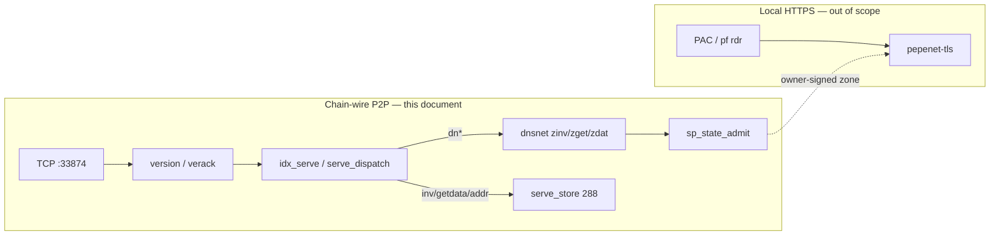
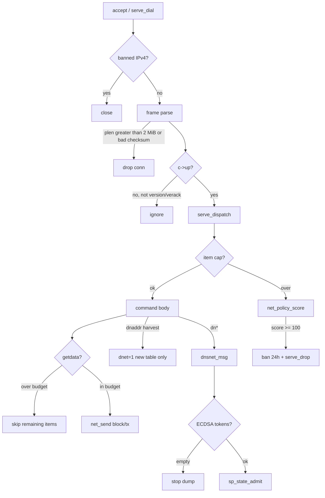
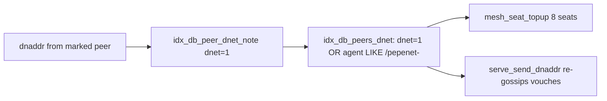
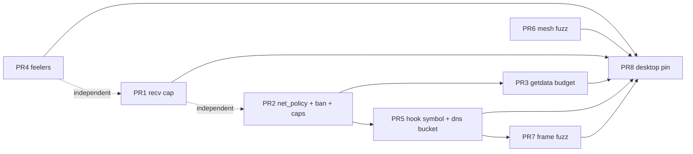

# Bitcoin-style P2P DoS hardening (stay in C)

| Field | Value |
|-------|--------|
| **Author** | PepeNet |
| **Date** | 2026-09-11 |
| **Status** | Accepted — implementing in C (no Rust) |
| **Audience** | Engineers implementing this in pepenet C (indexer / mesh `linux` / dns / desktop 0.2.3) |
| **Repos** | `namespace-indexer` (`main`), `pepenet-mesh` (`linux`), `pepenet-dns` (`main`), `pepenet-desktop` (branch `0.2.3` pin bump) |

Roadmap for Bitcoin-style local-policy DoS hardening in C. Implementation follows this document. No GitHub release unless asked.

---

## How this relates to SECURITY.md

[`pepenet-desktop/docs/SECURITY.md`](https://github.com/PepeNetWeb/pepenet-desktop/blob/0.2.3/docs/SECURITY.md) is the **threat model + 0.2.3 checklist**. It states what is already true on the wire, what the two planes trust, and the two leftover items that need a protocol bump or OS keychain work.

**This document is the DoS roadmap that follows that checklist.** It does not re-argue zone authenticity, DANE, or the local CA. It does not re-propose any 0.2.3 control as new work. When a constant or function is named here, it is the 0.2.3-pinned source, not a restatement of the threat model.

| Document | Owns |
|----------|------|
| `docs/SECURITY.md` | Planes, zone admission rules, 0.2.3 done/open checklist, "what we will not do" |
| This doc | Remaining **resource** DoS (CPU / memory / bandwidth / eclipse), Bitcoin-style local policy in C, PR sequence |

SECURITY.md leftovers that stay **out of this work**:

- Node identity key in `version` (protocol bump).
- CA key in login keychain / Secure Enclave.

tls / DANE / PAC stay a separate plane. Do not mix proxy connection caps (`PAC_CONN_MAX`, `PROXY_CONN_MAX`) into P2P score/ban.

SECURITY.md §2 still says a flood of valid owner ops costs ECDSA **“(dup is after crypto)”**. That parenthetical is stale. The §7 checklist (“Dup `op_id` skips ECDSA | done”) and mesh `linux` `sp_state_admit` (`state.c` ~362–382) are the source of truth: dup lookup returns `-1` *before* `sp_ecdsa_verify`. The remaining CPU threat this roadmap meters is **fresh valid owner** ops. PR8’s SECURITY.md edit is a one-line pointer to this doc — do not silently rewrite §2 in that pass.

---

## Overview

The 0.2.3 audit closed the RCE-class parser holes and the cheap overlay membership amp (handshake-before-serve, marked-only `dnaddr`, inbound mesh cap 16, `/16` mesh dials, zget 2s/peer, hold-queue blob dedupe, owner-key-before-ECDSA, dup `op_id` skip, P2P sha256d checksum). What remains is Bitcoin Core's old problem: a peer who speaks the protocol can still **burn CPU, RAM, and bandwidth**, and a gossiped `/pepenet-` mark is still **not a credential**.

Bitcoin Core stayed in C++ and solved this without peer PKI: ignore until version/verack, cap in-flight bytes, cap inv/getdata, score → disconnect → timed ban, announce hashes / pull bodies, cheap checks before ECDSA, AddrMan new/tried + feelers, treat `subver` as cosmetics.

PepeNet will do the same, **in the existing C files**, as **local policy** (no protocol version bump, no BIP324, no Rust rewrite of parsers / admission / serve). The six work items:

1. Drop handshake `net_recv` 32 MiB → 2 MiB (`SERVE_MSG_MAX`).
2. Per-command item caps + a Bitcoin-style misbehavior score.
3. Per-peer `getdata` budget (16 blocks / 16 MiB / 10 s, plus a per-message item walk cap).
4. ECDSA token bucket (~64 verifies/s/peer) on overlay dumps.
5. Feelers: do not treat a gossiped mark as overlay membership until **we** handshake it and see `/pepenet-`.
6. Extend the existing C fuzz harnesses to frames (`sp_state_op_parse`, `on_zdat`, `serve_dispatch`).

---

## Background & Motivation

### Current state (0.2.3 pin — do not re-propose)

Desktop branch `0.2.3` (`2043eff`) compiles **submodules from source** (`CMakeLists.txt` `DESKTOP_IDX_SRCS` / `dnet_mesh` / `dns_embed`). It does not vendor a second copy of `sync.c` / `dns_net.c` / `state.c`. The load-bearing pins:

| Submodule | Pin | Branch | What 0.2.3 already landed |
|-----------|-----|--------|---------------------------|
| `indexer/` | `8d7957c` | `main` | checksum, inbound mesh cap, `/16` mesh dials, honest self-IP, `VOUCH_RETRY_S` |
| `mesh/` | `a3a7594` | `linux` | owner-key before ECDSA; skip ECDSA when `op_id` already stored |
| `dns/` | `0ecbe43` | `main` | inbound zget 2 s/peer (`GET_COOL_S`); hold-queue blob dedupe |

**Sibling workspace checkouts lag those pins** (`namespace-indexer` `e7d88d0`, `pepenet-mesh` `main` `1138116`, `pepenet-dns` `249b6ba`). `pepenet-dns/Makefile` compiles `../namespace-indexer` + `../pepenet-mesh` from source. Implement against the **pinned** trees; bump the siblings when landing.

Load-bearing 0.2.3 sites (desktop pin line numbers):

| Control | Site |
|---------|------|
| Handshake before any non-version/verack command | `serve_dispatch` (`indexer/src/sync.c` ~1676) |
| `dngetaddr` / `dnaddr` only from `AGENT_MARKED` | `serve_dispatch` ~1758–1766 |
| Inbound mesh handles ≤ 16 | `MESH_INBOUND_MAX` ~1405; counted at ~1732–1740 |
| One mesh gossip slot per IP | `mesh_on_host` ~1994 |
| Mesh dials one `/16` | `mesh_seat_topup` ~2062–2066 |
| Ignore extra `version` when `c->up` | `serve_dispatch` ~1679–1682 |
| Self-IP from **outbound** `addr_recv`, globally-routable IPv4 | `serve_dispatch` ~1683–1694; `ipv4_globally_routable` ~555 |
| Serve-plane payload cap 2 MiB + sha256d | `SERVE_MSG_MAX` ~1398; parse loop ~2496–2505 |
| Inbound zget 2 s/peer | `dns/src/dns_net.c` `GET_COOL_S` |
| Hold-queue one slot per blob | `hold_push` `dns_net.c` ~136–148 |
| Owner-key before ECDSA; dup `op_id` skips verify | `mesh/src/state.c` `sp_state_admit` ~362–393 |

Serve-plane frame parse already drops `plen > SERVE_MSG_MAX`. The **blocking** `net_recv` used by handshake / sync / `serve_dial` still accepts 32 MiB (`sync.c` ~446). That is a memory DoS (liar length → `malloc(32MB)`), not a buffer overflow.

### Pain points this roadmap closes

| Class | What a peer can still do after 0.2.3 |
|-------|--------------------------------------|
| **Memory** | Handshake/`serve_dial`/sync `net_recv` mallocs up to 32 MiB per length field. Desktop `wallet.c` has a third copy of the same 32 MiB cap (and does not check sha256d). |
| **Bandwidth** | `serve_dispatch` `getdata` walks every inventory item and `net_send`s the raw block with **no** per-peer rate. Any `c->up` peer (`SERVE_MAX_CONN` 64, not only mesh-marked) can ask for the whole `SERVE_BLOCK_WINDOW` (288) in one dispatch. `inv` / `addr` / `dnaddr` declared counts are not scored. |
| **CPU** | `on_zdat` admits up to 1024 ops (`dns_net.c` ~238). Dup-skip and owner-key-before-ECDSA kill *replay* and *foreign-key* dumps. A flood of **fresh, valid, owner-signed** ops still pays `sp_ecdsa_verify` (libsecp) + `BEGIN IMMEDIATE`. Unsolicited `zdat` is not gated by `GET_COOL_S`. |
| **Eclipse / poison** | `addr_harvest(..., dnet=1)` persists overlay membership from a gossiped mark (`idx_db_peer_dnet_note`). `serve_send_dnaddr` re-gossips `idx_db_peers_dnet` including never-handshaked vouches (`retry_cut=0, vouch_cut=0`). `/pepenet-` remains a self-asserted user-agent. |

Approximate surface (0.2.3 pin): `sync.c` 2800, `dns_net.c` 305, `state.c` 614, `wire.c` 46, `crypto.c` 127.

---

## Goals & Non-Goals

### Goals

- Cap resource use of a single TCP peer (and of `SERVE_MAX_CONN` 64 serve slots / 16 inbound mesh handles) so a laptop-class node stays interactive.
- Keep every change as **local policy** in C: caps, scores, bans, token buckets, feelers.
- Reuse Bitcoin Core's numbers where they map onto constants we already have (`MAX_INV_SZ` 50k already in comments, `MAX_ADDR_TO_SEND` 1000 already in `addr_harvest`, `SERVE_BLOCK_WINDOW` 288, `SERVE_MSG_MAX` 2 MiB).
- Land incrementally: each PR independently reviewable and mergeable; desktop only pins after the submodule PRs exist.

### Non-goals

- **No Rust rewrite** of parsers, admission, or serve. No `pepenet-wire` crate. Alternatives that propose Rust are rejected by product decision (see Alternatives).
- No BIP324 / transport AEAD.
- No node-identity key in `version`.
- No protocol version bump. If a work item looks like it needs one, it is out of scope — do it as local policy instead.
- No GitHub release unless asked.
- No mixing the DANE/PAC plane into P2P score/ban.
- No change to zone authenticity (`sp_state_admit` owner/lease/anchor rules stay).

---

## Key Decisions

1. **Stay in C, local policy only.** Bitcoin Core's DoS model (caps, score, ban, feelers) maps onto `SConn` / `Peer` / `peers` without a wire change. A version-key would authenticate overlay membership; that is a separate SECURITY.md open and is not a prerequisite for bounding blast radius.

2. **One message-size constant: 2 MiB.** Serve already uses `SERVE_MSG_MAX` (`2 * 1024 * 1024`). Handshake `net_recv` drops from 32 MiB to the same cap. Pepecoin/Dogecoin-1.14 blocks are 1 MiB-class; 2 MiB leaves margin. Bitcoin Core’s `MAX_PROTOCOL_MESSAGE_LENGTH` is `4 * 1000 * 1000` (4 000 000, witness); we do not need that.

3. **New `src/net_policy.c` in the indexer**, not more lines stuffed into 2800-line `sync.c`. Score, ban list, item caps, and the getdata window live in a unit-testable file. `serve_dispatch` / `accept` / topup call it. Add `src/net_policy.c` to every compile graph that already lists `sync.c` (`indexer/Makefile` `IDX_SRCS`, `pepenet-dns/Makefile` `IDX_SRC`, desktop `DESKTOP_IDX_SRCS`).

4. **Score 100 disconnects; ban 24 h; in-memory; per-IPv4; no /16 ban.** Classic Bitcoin `nDoS` / `DEFAULT_MISBEHAVING_BANTIME`. NAT'd honest peers share an IP — /16 bans would eclipse ourselves. v1 does **not** persist bans (process restart clears). Score is **per-conn**; ban is **per-IP**. Reconnect before 100 resets score — the ban is what makes score stick, and only after one conn accumulates 100. Full table: evict expired first, then oldest `until`.

5. **getdata: 16 blocks or 16 MiB per 10 s, whichever first, on every serve conn.** 16 is Bitcoin `MAX_BLOCKS_IN_TRANSIT_PER_PEER` used here as a **serve-side local policy**, not a Core serve-path copy (Core uses it as an in-flight *request* cap). 16 MiB is 16 × a 1 MiB-class pep block, so the two caps bind together and a 288-window dump is 18 windows ≈ **3 minutes**. Also cap **loop iterations** (`IDX_GETDATA_ITEMS` 128 per message) so 50k unknown hashes cannot stall the serve thread without sending a byte. Excess is **ignored, not scored**. Blast radius is `SERVE_MAX_CONN` 64, not `MESH_INBOUND_MAX` 16.

6. **ECDSA bucket lives on `dns_net.c` `Peer`, not in `sp_state_admit`.** Admit does not know the peer and does not report how many secp verifies it ran. Charge from `on_zdat` using admit’s existing `rc`/`err` (no mesh API change): 1 token per op that is not a cheap reject (see §4). 64 verifies/s, burst 64, per `Peer` (outbound mesh seats dump too; `MAX_PEERS` 64, typical 8 outbound + 16 inbound). Drop inbound `zdat` op cap 1024 → 64 so one frame cannot queue more work than the burst. Do **not** put a global inbound `last_zdat` 2 s cooldown on solicited dumps.

7. **AddrMan mapping on existing columns, no new table.** Queries, not slogans:
   - **tried / `dnaddr`:** `agent LIKE IDX_DNET_MARK '%'`, regardless of `dnet`.
   - **new / feeler:** `dnet=1 AND agent NOT LIKE IDX_DNET_MARK '%'`, `VOUCH_RETRY_S` on `last_try` (do **not** require `agent = ''` — unmarked `/Satoshi/…` must stay feelable).
   - **`SConn.feeler`:** at most one of `MESH_DIAL_SEATS` (8). Topup fills 7 tried first; never seats a second feeler.
   Unmarked feeler calls `idx_db_peer_tried` (stamp `last_try` only) then releases; do **not** reuse `idx_db_peer_seen`. First marked inbound **INSERTs** a listen-port row so the observation can enter `dnaddr`.

8. **v1 adds trailing `IdxMeshHooks.peer_misbehave` and exports `serve_conn_misbehave`.** NULL-checked. Set from `dnsd.c` and desktop `src/dnsnet.c` (today both are positional `{ mesh_up, mesh_msg, mesh_down, mesh_tick, NULL }`) **and** passed to `dnsnet_set_misbehave`. Overlay floods (`zinv`/`zdat` over-cap, non-owner dumps) `serve_drop` + ban; dns-local strikes that leave TCP up do **not** meet Goal 1. The ABI field lands in PR5 with the first caller, not in the kitchen-sink PR2.

9. **Fuzz in the existing C harness style first; libFuzzer optional.** `mesh/test/wire_test.c` already mmap-guards `sp_cert_parse` / `sp_state_op_parse`. Extend that pattern to `dnsnet_msg` and a `net_policy` helper. Do not introduce a Rust fuzzer crate.

10. **Desktop consumes submodules from source; the only desktop-local P2P recv is `src/wallet.c`.** Pin bump on `0.2.3` after indexer/mesh/dns PRs. `wallet.c` `net_recv` (tx broadcast) gets the same 2 MiB cap + sha256d checksum. There is no vendored copy of `sync.c` / `state.c` / `dns_net.c`.

---

## Proposed Design

### Planes (unchanged)



A DoS peer talks to `idx_serve`. Overlay dumps only run after `mesh_handle` is set (marked + inbound cap + one slot per IP). Score/ban/caps wrap that path. The proxy never sees P2P frames.

### Target architecture (policy sitting on 0.2.3)



### 1. Handshake recv cap (memory)

**Today.** `net_recv` (`indexer/src/sync.c` ~441–451):

```c
uint32_t l = /* header bytes 16..19 */;
if (l > 32 * 1024 * 1024) return -1;
uint8_t *buf = malloc(l ? l : 1);
```

Callers: `p2p_handshake` (~629, 8 s), sync/getheaders drain (~876, ~1267, ~1295), `serve_dial` (~1950, 3 s). Serve-plane poll loop is separate and already 2 MiB.

**Change.** Replace the 32 MiB literal with `SERVE_MSG_MAX` (already `2 * 1024 * 1024` at ~1398). Move the constant above `net_recv` (it is currently defined 900 lines later) or share it via `net_policy.h` as `IDX_MSG_MAX`.

**Handshake can be tighter** (a `version` is < 200 bytes; `CRAWL_BUF_MAX` is already 256 KiB). Still use 2 MiB for `net_recv` so the **sync path** that shares the function can receive a 1 MiB-class block. Do not split handshake/block caps in v1 — one constant, one review.

**Desktop `wallet.c` ~502–510** is a third copy: 32 MiB and **no checksum**. Same 2 MiB cap, and add the sha256d check that `sync.c` `net_recv` already does. Wallet is a short-lived broadcast socket; still do not let a seed malloc 32 MiB.

**Risk (low):** if Pepecoin ever ships blocks > 2 MiB, sync via `net_recv` fails closed (abandon peer). Serve already cannot send them. Mitigation: the constant is one `#define`; raise it with `SERVE_MSG_MAX` together.

**Expected memory:** liar-length malloc 32 MiB → 2 MiB. Serve table stays 64 × (2 MiB + 1 KiB) ≈ 128 MiB worst-case accumulator, unchanged.

### 2. Per-command item caps + misbehavior score

**Today.** Caps exist as silent clamps, not as a score:

| Command | Current behavior | Gap |
|---------|------------------|-----|
| `inv` (sync pass) | Comment cites `MAX_INV_SZ` 50000; pulls ≤ 600 blocks | Serve path does **not** reject cnt > 50000 |
| `inv` (serve) | Pulls ≤ 128 tx + 16 block hashes | No score on huge declared count |
| `getdata` | Walks every item in the payload | No count cap, no rate |
| `addr` | `addr_harvest` clamps `cnt > 1000` to 1000 | Oversize is truncated, not scored |
| `getaddr` | Answers ≤ 1000 rows | Fine |
| `getheaders` / `getblocks` | `nloc > 2000` returns | Fine |
| `dnaddr` | Harvest same 1000; send `SERVE_DNADDR_MAX` 256 | Unmarked already ignored |
| `zinv` | `count > 4096` drop | No score |
| `zget` | `GET_COOL_S` silent return | Do **not** score (clock skew) |
| `zdat` | `count > 1024` drop | See item 4 |

**Score model** (Bitcoin Core `Misbehaving`, flattened):

```c
#define IDX_BAN_SCORE     100
#define IDX_BAN_S         (24 * 3600)   /* DEFAULT_MISBEHAVING_BANTIME */
#define IDX_BAN_CAP       4096          /* match IDX_PEER_CAP */
#define IDX_MAX_INV_SZ    50000
#define IDX_MAX_ADDR      1000          /* already in addr_harvest */
```

Add to `SConn`: `int score`. `net_policy_score(SConn *c, int n, const char *why)` adds `n`, logs once, and if `score >= 100` calls `net_policy_ban(hip)` + `serve_drop`. Score lives on the conn: a peer who disconnects at 80 and returns is clean. The **ban** is what makes score real, and only after one held conn reaches 100.

**Ban list:** process-global IPv4 table (fixed 4096, hash or sorted array). Check in `accept` (alongside `SERVE_INBOUND_PER_HOST`; listen plane is IPv4-only, `sockaddr_in` at `sync.c` ~2443–2448) and in `mesh_seat_topup` / `chain_topup` / `serve_dial`. Not persisted in v1 (desktop restart clears; dnsd restart clears). Insert: drop expired `until` first; if still full, evict the oldest `until` and insert. Never refuse a new ban because the table is full of decoys.

**Do not ban /16.** `same_group16` stays an **outbound seating** eclipse rule, not a punitive one.

#### Score table

| Event | Score | Notes |
|-------|-------|-------|
| Declared `inv` / `getdata` count > 50 000 | +20 | Bitcoin oversized-inv. Drop the message. |
| Declared `addr` / `dnaddr` count > 1 000 | +20 | We already clamp; now also score. Drop extras. |
| `getheaders`/`getblocks` `nloc > 2000` | +10 | Today silent return. |
| `zinv` count > 4096 | +20 | Already dropped in `on_zinv`. Need a score hook from mesh → serve (see below). |
| `zdat` count > `ZDAT_OPS_MAX` (64) | +20 | Policy tighten vs today's 1024. |
| Non-owner op (`rc == 0` and `strstr(err, "signer is not the owner")`) | +1 each, cap +20 / frame | Same `err` match `on_zdat` already uses for the token bucket (Issue 5 / §4). Cheap hash160; 100 of them bans. Other `rc == 0` (budget, anchor, high-S, malformed) do **not** score. |
| Invalid magic / bad checksum / `plen > SERVE_MSG_MAX` | drop conn, **no** score | Already fatal at parse; do not double-count. |
| Second `version` on live conn | 0 | Already ignored. |
| Command before handshake | 0 | Already ignored. |
| Unknown command | 0 | Bitcoin ignores. |
| `zget` inside `GET_COOL_S` | 0 | Silent. Honest burst + skew. |
| `getdata` over byte/block/item budget | 0 | Ignore remaining items (item 3). Walk cap is 128 lookups/message. |
| Invalid block body on serve `block` | 0 | Stage already caps 32 rows / 1 h. Validation is the sync thread's job. |

**Overlay → serve score hook (v1, decided).** Dns-local `p->strikes` that stop sending but leave TCP up still occupy a mesh slot and can `getdata` until `SERVE_DEAD_S` (600 s) — that does not meet Goal 1. v1 **does** add a trailing optional field. `serve_mesh_send`'s `peer` **is** the `SConn *`. NULL-checked so standalone `indexerd` (`mesh == NULL`) and any caller that has not been rebuilt still compile and run (overlay floods then wait out dead-timeout until the two `mesh` initializers are updated).

Hook (indexer.h, local policy, not a wire bump):

```c
typedef struct {
    void *(*peer_up)(void *ud, void *peer,
                     void (*send)(void *peer, const char *cmd, const uint8_t *pay, size_t n));
    void  (*peer_msg)(void *ud, void *handle, const char *name, const uint8_t *pay, int n);
    void  (*peer_down)(void *ud, void *handle);
    void  (*tick)(void *ud);
    void   *ud;
    /* optional: overlay reports local-policy strikes against this SConn */
    void  (*peer_misbehave)(void *peer, int score, const char *why);
} IdxMeshHooks;
```

`dnsnet_up` already receives `peer` (the `SConn *`). Store it on `Peer` (already `Peer.peer`).

**Concrete v1 wiring.** Export `void serve_conn_misbehave(void *peer, int n, const char *why);` from `indexer.h`, implemented in `sync.c` (not static): cast `peer` to `SConn *`, `net_policy_score`. Embedders set the trailing field **and** hand the same symbol to dns:

```c
IdxMeshHooks mesh = { mesh_up, mesh_msg, mesh_down, mesh_tick, NULL, serve_conn_misbehave };
dnsnet_set_misbehave(serve_conn_misbehave);
idx_serve(..., &mesh);
```

`on_zinv` / `on_zdat` call `g.misbehave(from->peer, 20, "zinv count")`. `idx_serve` also uses `serve_conn_misbehave` for inv/addr caps on that `SConn`.

Callers that must grow the initializer (today positional 5-field, so the new member is NULL until they do):

- `pepenet-dns/src/dnsd.c` ~232
- `pepenet-desktop/src/dnsnet.c` ~436

ABI addition at the end of a struct we compile from source everywhere, plus one new symbol. No protocol bump. Trailing zero-init keeps old literals NULL-safe.

### 3. getdata budget (bandwidth)

**Today.** `serve_dispatch` `getdata` (~1845–1862) loops `cnt` items and for each type-2 hash calls `serve_store_block` + `net_send(..., "block", raw, rl)` with no yield. `getblocks` will happily advertise up to 500 hashes (`serve_store_hashes_from(..., 500)`) that all sit inside the 288-block window.

Quantities already in tree:

| Constant | Value | Meaning |
|----------|-------|---------|
| `SERVE_BLOCK_WINDOW` | 288 | BIP159 limited node; max bodies we hold |
| getblocks answer | 500 hashes | more than the window |
| serve inv-pull of blocks | 16 | what **we** ask of a peer (`wblk[16]`) |
| `SERVE_MSG_MAX` | 2 MiB | one frame |
| pep block cadence | 1 min | 288 min ≈ 5 h of bodies |

Bitcoin `MAX_BLOCKS_IN_TRANSIT_PER_PEER` is 16 (how many blocks *we request* in flight). We reuse 16 as a **serve-side local dump cap**, not as a Core serve-path copy. A 1 MiB-class block × 16 = 16 MiB per peer per 10 s.

`getdata` runs for any `c->up` peer, not only mesh-marked handles. `MESH_INBOUND_MAX` 16 is a gossip-slot cap; `SERVE_MAX_CONN` is 64. Worst-case writes after this policy: **64 × 16 MiB / 10 s**, not 16 × 16 MiB.

A 50 000-hash `getdata` of unknown hashes (`IDX_MAX_INV_SZ` still allows that *declared* count) would walk `serve_store_block` 50k times without incrementing served-block/byte counters. Cap **iterations**, not only successful sends.

**Policy:**

```c
#define IDX_GETDATA_WINDOW_S   10
#define IDX_GETDATA_BLOCKS     16                 /* analog of Core in-flight, serve-side */
#define IDX_GETDATA_BYTES      (16u * 1024 * 1024) /* 16 × 1 MiB-class pep block */
#define IDX_GETDATA_ITEMS      128                 /* lookups per message, hit or miss */
```

On `SConn`: `time_t gd_win_t; int gd_blocks; uint32_t gd_bytes`. Each 10 s, reset counters. Each **examined** inventory item (block or tx, found or not) counts toward `IDX_GETDATA_ITEMS` for this message; stop the loop at 128. Each **served** block increments `gd_blocks` and `gd_bytes`; each served tx counts bytes only. When the next *served* body would exceed blocks or bytes for the 10 s window, **stop the loop** (leave remaining items unanswered). Do not score. Declared `cnt > IDX_MAX_INV_SZ` still scores +20 and drops the whole message before the walk.

Honest catch-up of the 288-window at 1 MiB/block: 288/16 = 18 windows ≈ **3 minutes** (byte cap and block cap bind together). A peer at tip asking for the new block: 1 body / 10 s is far above need (we also **push** `inv` for new tips ~2 s, and they pull 16 hashes max).

Tx `getdata` (type 1) is bounded by `TX_MAX_SIZE` 100 KB and `MEMPOOL_MAX_TXS` 5000. Count against the **byte** budget so a mempool dump cannot bypass the block cap, and against `IDX_GETDATA_ITEMS` so a 128-unknown-tx walk is the per-message ceiling.

**Sync-pass `getdata` we send** (≤ 600 hashes, `sync.c` ~1280) is outbound and not this control. Do not throttle our own IBD.

### 4. ECDSA token bucket (CPU)

**Today.** `sp_state_admit` (`mesh/src/state.c`, `linux` pin):

1. `sp_state_op_parse` (no crypto).
2. `sp_name_valid`.
3. `owner_now` (lease gate).
4. **Dup `op_id` lookup** → return `-1` (no ECDSA).
5. **`sp_key_is_owner` before ECDSA** on the non-cert path (hash160).
6. `low_s` + `sp_ecdsa_verify`.
7. Optional `sp_cert_verify` (more ECDSA on the owner/delegate keys).
8. Anchor + `BEGIN IMMEDIATE` LWW.

SECURITY.md §2’s remaining claim is right: *fresh valid* owner ops still cost secp. (The “dup is after crypto” parenthetical is stale; see How this relates.) `on_zdat` will run that path up to 1024 times per frame today. Unsolicited `zdat` is not on `GET_COOL_S`; v1 does **not** add a global inbound `last_zdat` cooldown (that would stall a solicited 64-name pull at 2 s/name ≈ 2 minutes). `GET_COOL_S` stays the cap on dumps **we send**.

**Cost model.** libsecp256k1 ECDSA verify is ~30–80 µs on a laptop (call it 50 µs). Rate is per `Peer`, and outbound mesh seats dump too (`MAX_PEERS` 64; typical 8 outbound + 16 inbound). 16 inbound × 64/s = 1024/s ≈ 50 ms CPU/s (~5% of one core) plus sqlite — plausible laptop budget, not re-benchmarked. An 8 KiB zone (`DNS_BUDGET`) at ~150 B/op is ~50 ops — **one burst**. The 1024 cap is the attack size, not the honest size.

**No mesh API change.** `sp_state_admit` returns `1 / 0 / -1 / -2` and a string `err`. It does not report verify count. `rc == -2` (hold) **already verified** (header check is after ECDSA). `rc == 0` mixes cheap rejects with paid ones. Cert path skips `sp_key_is_owner`, so a hostile P2SH dump still burns secp inside admit — charge **after** each call using `rc`/`err`, and `break` when tokens are empty so a cert dump cannot run past the burst.

**Charge rule in `on_zdat`** (1 token per op passed to `sp_state_admit`, then `break` if empty):

| After `sp_state_admit` | Charge? | Why |
|------------------------|---------|-----|
| `rc == -1` (dup) | no | 0.2.3 lookup is before ECDSA |
| `rc == 0` and `err` is `malformed op` / `invalid name` / `name unowned` / `signer is not the owner` | no | cheap parse / hash160 / lease |
| `rc == 0` otherwise (`signature invalid`, `delegation cert invalid`, budget, anchor, …) | yes | paid or mixed; treat as paid |
| `rc == -2` (hold) | yes | ECDSA already ran |
| `rc == 1` (admitted) | yes | ECDSA ran |

Do **not** try to count `n_sigs` through admit. One token per op; `ZDAT_OPS_MAX` 64 already equals `ECDSA_BURST`, so a P2SH dump cannot exceed the burst in one frame. If tokens hit 0 mid-frame, `break` — leftover ops drop; anti-entropy (`AE_PERIOD_S` 60) resends.

```c
#define ECDSA_RATE     64    /* tokens per second per Peer */
#define ECDSA_BURST    64    /* one honest zone dump */
#define ZDAT_OPS_MAX   64    /* was 1024; one frame ≤ burst */
```

Token bucket: integer tokens, refilled by `now - last_refill`, capped at `ECDSA_BURST`.

`hold_service` retries **our** held ops — do not charge the original peer (and there may be none). Local `dns_state_put` from the UI does not go through `on_zdat`.

**Do not put the bucket in `sp_state_admit`.** Admit is overlay-agnostic and peer-blind. Mesh `linux` stays the cheap-reject layer; dns is the per-peer meter.

**Unsolicited `zdat`:** keep allowed (a publisher may push). Bound it with the token bucket + `ZDAT_OPS_MAX` only. Do **not** apply `GET_COOL_S` to inbound `on_zdat`: anti-entropy advertises up to `INV_BATCH` 64 names and `on_zinv` emits one `dnzget` per mismatch (`PULL_COOL_S` 15 s per (peer, name)). A global 2 s inbound dump cooldown would make a solicited 64-name catch-up take ~2 minutes. `g.pull[]` is outbound-get state, not a reliable “this zdat is a reply” predicate without adding a matching inbound name list — out of v1.

### 5. Feelers for overlay membership (eclipse)

**Today.**



`VOUCH_RETRY_S=3600` and `DIAL_RETRY_S=600` already keep dead NAT hints off the blocking `serve_dial`. They do **not** stop us from **re-advertising** never-observed marks (`serve_send_dnaddr` calls `idx_db_peers_dnet(db, pool, 256, 0, 0)`).

`/pepenet-` is cosmetics. Bitcoin's answer is AddrMan: **new** (unconfirmed) vs **tried** (we connected), plus a **feeler** outbound that tests new without mixing it into the advertised set.

**Mapping onto existing `peers` columns** (`db.h` / `db.c`) — queries an implementer can copy:

| AddrMan | SQL / field | Rule |
|---------|-------------|------|
| **tried / `dnaddr`** | `agent LIKE IDX_DNET_MARK '%'` | Regardless of `dnet`. Set only when **we** observed the subver (`idx_db_peer_seen` on a marked handshake, or inbound INSERT below). |
| **new / feeler candidate** | `dnet=1 AND agent NOT LIKE IDX_DNET_MARK '%'` | Persist so restarts still have someone to probe. `VOUCH_RETRY_S` on `last_try`. Do **not** require `agent = ''`: an unmarked feeler that `peer_seen` would have stamped `/Satoshi/…` must remain feelable; `idx_db_peer_dnet_note` never clears `agent`. **Never** included in `dnaddr`. |
| **feeler seat** | `SConn.feeler` (new bit next to `mesh_seat` / `chain_seat` at `sync.c` ~1463–1466) | At most one of `MESH_DIAL_SEATS` (8). Topup fills tried first (up to 7); will not seat a second feeler. Without this bit, 8 unmarked vouches still occupy every seat — the failure mode this item exists to stop. |

**Unmarked feeler outcome.** Do **not** reuse the 0.2.3 path at `sync.c` ~2407–2413 (`idx_db_peer_seen` then release). That stamps `agent` + `last_good` and then drops the seat, so a `/Satoshi/…` peer is neither tried (`LIKE '/pepenet-%'`) nor new (`agent = ''` under the old wording) and is lost until TTL. Instead: `idx_db_peer_tried` (or a one-line variant that updates `last_try` only — no `agent`, no `last_good`), then release the feeler seat.

**Marked feeler / marked outbound.** `idx_db_peer_seen` as today (promotes to tried) and keep the seat; clear `c->feeler` so the slot counts as tried.

**`serve_send_dnaddr` change.** `idx_db_peers_dnet_confirmed` only (`agent LIKE IDX_DNET_MARK '%'`). Self-announce stays. Today’s `idx_db_peers_dnet(db, pool, 256, 0, 0)` is the re-gossip-never-seen-marks bug.

**`mesh_seat_topup` change** (function starts ~2038; `/16` clash ~2062–2066). Count `mesh_seat && !feeler` vs `feeler`. If tried < 7, seat from `_confirmed` (one candidate per tick, existing blocking-dial discipline). Else if no `feeler` seated, seat one row from `_new` under `VOUCH_RETRY_S`, set `c->feeler = 1`. `/16` still applies to all mesh seats.

**Inbound marked.** `idx_db_peer_touch_agent` is UPDATE-only (`db.c` ~283–292): a first inbound from an IP with no listen-port row stamps nothing, so “inbound observation may enter `dnaddr`” is false today. v1: grow it to **INSERT** `host:<coin_port>` if missing (`agent` set, `last_good = 0`, `last_seen = now`). Ephemeral inbound port is not the row; the listen port is. That is “we observed the mark” and it may enter `dnaddr`.

**What we will not do here:** a version-key, or "only dial addresses whose mark we observed" as a hard rule that deletes the new table. Feelers *are* how we observe. SECURITY.md's "until a version-key exists, treat the mark as a hint plus caps" remains true; this makes the hint non-self-propagating.

### 6. Fuzz

**Today.**

- `mesh/test/wire_test.c`: guard-paged arena, truncation sweep, declared-length attacks, random + grammar-aware mutation of `sp_state_op_parse` / `sp_cert_parse`. Header still says “THIS SUITE FAILS” (lines 30–32, historical decoder bug). PR6 first step: confirm `make check` / `make check-ubsan` on `linux@a3a7594` is green and remove or update that banner before adding libFuzzer wrappers on the same decoders.
- `dns/test/net_test.c`: hostile zinv/zget/zdat, 200k mutations. `dns/Makefile` ~152–157 keeps `check-gossip` out of `check-all` because no-change dumps livelocked; 0.2.3 `on_zdat` is already silent on no-change (`dns_net.c` ~260–265). PR5 inverts those assertions and folds `check-gossip` into `check-all` (or documents a remaining real defect if one still fails).
- `dns/test/wire_test.c`: `dns_wire.c` only; `make check-fuzz`.
- Indexer `test_serve.c` covers `serve_store`, **not** `serve_dispatch`. `serve_dispatch` is `static`.

**Plan.** Stay in C. Three harnesses, no new language:

1. **mesh (already good):** add `LLVMFuzzerTestOneInput` wrappers in `mesh/test/fuzz_op.c` / `fuzz_cert.c` behind `make fuzz` (`-fsanitize=fuzzer,address` when clang supports it). Same decode functions. Keep `wire_test` as the CI default (no libFuzzer runtime required on Darwin).

2. **dns:** extract nothing if possible — `dnsnet_msg` is already a `(cmd, payload, n)` entry. `net_test.c` grows a guard-paged `on_zdat`/`on_zinv` soak (copy `wire_test.c`'s arena). Optional `fuzz_zdat.c` calling `dnsnet_msg(h, "zdat", data, n)` after `dnsnet_init` + one `dnsnet_up`.

3. **indexer:** do **not** try to fuzz 2800-line `idx_serve`. Put count-cap / getdata-budget / score in `net_policy.c` and unit-test them in `src/test_net_policy.c` (new `make check` member). A later `fuzz_dispatch.c` can feed `(cmd[12], payload)` to a function:

   ```c
   /* test/fuzz seam — not a protocol change */
   int serve_policy_check(const char *cmd, const uint8_t *pl, uint32_t n, int *score_add);
   ```

   Frame checksum/magic stay in the poll loop.

**CI:** `make check` stays green without libFuzzer. `make fuzz` is opt-in on Linux CI with clang.

---

## API / Interface Changes

No P2P commands added or removed. No `version` extra fields.

### indexer.h

- `IdxMeshHooks.peer_misbehave` (optional, trailing field). v1 **does** add it (Key Decision 8).
- `void serve_conn_misbehave(void *peer, int n, const char *why);` — implemented in `sync.c`, not static. Embedders pass this symbol as the trailing field **and** to `dnsnet_set_misbehave`.
- No change to `idx_serve` signature.

### New files (indexer)

```
indexer/src/net_policy.h
indexer/src/net_policy.c
indexer/src/test_net_policy.c
```

Sketch:

```c
#define IDX_MSG_MAX           (2u * 1024 * 1024)
#define IDX_MAX_INV_SZ        50000
#define IDX_MAX_ADDR          1000
#define IDX_BAN_SCORE         100
#define IDX_BAN_S             (24 * 3600)
#define IDX_GETDATA_WINDOW_S  10
#define IDX_GETDATA_BLOCKS    16
#define IDX_GETDATA_BYTES     (16u * 1024 * 1024)
#define IDX_GETDATA_ITEMS     128

int  net_policy_inv_count(const uint8_t *pl, uint32_t n, uint64_t *cnt, uint32_t *off);
int  net_policy_banned(const char *ip, time_t now);      /* 1 = refuse */
void net_policy_ban(const char *ip, time_t now);         /* evict expired, then oldest until */
int  net_policy_score_add(int *score, int n);            /* 1 = crossed 100; per-conn */
int  net_policy_getdata_ok(int *blocks, uint32_t *bytes, time_t *win, time_t now,
                           int add_blocks, uint32_t add_bytes);
int  net_policy_getdata_items_ok(int examined);          /* 1 if examined < IDX_GETDATA_ITEMS */
```

`sync.c` includes this header; `SERVE_MSG_MAX` becomes `IDX_MSG_MAX` or a one-line alias.

### dns_net.h / Peer

```c
/* on Peer — no last_zdat (v1 does not cooldown inbound dumps) */
int    ecdsa_tokens;
time_t ecdsa_t;
```

`ZDAT_OPS_MAX 64` next to `GET_COOL_S`. `dnsnet_set_misbehave(void (*fn)(void *peer, int score, const char *why))` stored in `g`. Overlay over-cap / non-owner strikes go through that fn to `SConn` score, not a dns-local counter that leaves TCP up.

### mesh

No public API change. `sp_state_admit` already has the 0.2.3 cheap path. Fuzz files only.

### db.h

Current `idx_db_peers_dnet` is already five arguments (`db, out, max, retry_cut, vouch_cut`) with `ORDER BY (agent LIKE …) DESC`. Do **not** add a sixth `which` flag. Two helpers, named for the two queries in §5:

```c
int idx_db_peers_dnet_confirmed(sqlite3 *db, char (*out)[80], int max);
/* agent LIKE IDX_DNET_MARK '%' */

int idx_db_peers_dnet_new(sqlite3 *db, char (*out)[80], int max,
                          int64_t vouch_cut);
/* dnet=1 AND agent NOT LIKE IDX_DNET_MARK '%', skip last_try > vouch_cut */
```

`serve_send_dnaddr` uses `_confirmed`. Topup tried uses `_confirmed`; feeler uses `_new`. Existing `idx_db_peers_dnet` remains as the old mixed query until call sites move, then drop — only called from `sync.c`.

`idx_db_peer_touch_agent`: INSERT listen-port row `host:<coin_port>` if missing (`agent` set, `last_good = 0`). Unmarked feeler: `idx_db_peer_tried` only (no `peer_seen`).

---

## Data Model Changes

**No schema migration required for v1.**

`peers.dnet` meaning changes from "overlay member (gossip or confirmed)" to **"unconfirmed overlay hint (new table)"**. Confirmed membership is `agent LIKE IDX_DNET_MARK '%'`, regardless of `dnet`. `idx_db_peer_dnet_note` still sets `dnet=1` and does not clear `agent`; `_new` therefore uses `NOT LIKE`, not `agent = ''`. `serve_send_dnaddr` reads only `_confirmed`.

`idx_db_peer_touch_agent` grows from UPDATE-only to INSERT-if-missing on `host:<coin_port>` so a first marked inbound is persisted (last_good stays 0).

Ban list is **not** a sqlite table in v1 (in-memory, decided). Full-table insert evicts expired then oldest `until`. If dnsd operators later want persistence, add `bans(ip PRIMARY KEY, until)` in a follow-up — not this roadmap's blocker.

Feelers persist because `dnet=1` rows already persist (`IDX_PEER_TTL_SECS` = 14 days, `IDX_PEER_CAP` = 4096). That is the AddrMan new table.

---

## Alternatives Considered

### A. Rewrite parsers / admission / serve in Rust (`pepenet-wire`)

Memory safety in the frame codecs. We already audited those codecs: no RCE-class overflow; `wire_test.c` is the regression net. The remaining class is **policy** (caps, scores, buckets), which Rust does not uniquely solve. A crate would fork the pin story (`CMakeLists.txt` "one pin, one truth"), block Windows/MinGW and the dnsd Makefile, and delay every item below. **Rejected — product decision: stay in C, no Rust on the critical path.**

### B. Protocol bump: node identity key in `version`

Would make `/pepenet-` a credential and make feelers less necessary. Already an open in SECURITY.md. Needs a version bump, key distribution, and replay rules. **Out of scope.** Feelers + caps are the local-policy substitute.

### C. BIP324 transport AEAD

Stops bit-twiddling and some traffic analysis. Does not stop a valid peer from `getdata`-dumping us or sending valid owner ops. **Out of scope** (user: not this work).

### D. Drop unconfirmed vouches entirely (no new table)

Simplest eclipse defense: `dnaddr` harvest does not call `idx_db_peer_dnet_note`; mesh seats only `peer_seen` agents. A fresh node then finds overlay **only** via crawl luck + hardcoded seed. Feelers exist specifically so gossip can still *introduce* candidates. **Rejected as the v1 default;** we keep `dnet=1` as new, not as member. (If operators want this stricter mode later, it is a one-query change.)

### E. In-process score only, no timed ban

Disconnect-on-100 without a ban lets the peer reconnect immediately (we allow 3 inbound per host). Bitcoin learned this; the ban is the part that makes score real. **Rejected.**

---

## Security & Privacy Considerations

**Threat model (delta over SECURITY.md §2–3):** a TCP client that completes `version`/`verack`, optionally lies `/pepenet-`, and then spends our CPU/RAM/bandwidth or poisons `dnaddr`.

| Threat | Severity | Mitigation |
|--------|----------|------------|
| Liar `length=32MB` on handshake | Medium (memory) | `net_recv` 2 MiB |
| `getdata` the 288-window in one dispatch | High (bandwidth / serve-thread stall) | 16 blocks / 16 MiB / 10 s on every `c->up` conn; 128 lookups/message |
| 1024 valid owner ops per `zdat` | High (CPU) | burst 64 + 64/s + `ZDAT_OPS_MAX` 64 |
| Re-gossip never-seen `/pepenet-` marks | High (eclipse / poison) | dnaddr = tried only; feeler slot |
| Botnet of marked inbound | Medium (already) | `MESH_INBOUND_MAX` 16 (0.2.3) |
| Score inflation of an honest peer | Medium | Conservative table; do not score unknown cmds, zget cooldown, getdata leftover |
| Ban of a NAT'd shared IPv4 | Low | 24 h, per-IP not /16; 3 inbound/host still applies to other IPs |
| Ban list as a tracking surface | Low | IPs we already have in `peers`; in-memory; not exported |
| `peer_misbehave` hook abuse | Low | Compiled-in overlay only; not a wire command |

Authn does **not** change: zone ops still owner-ECDSA; `/pepenet-` still not a credential. Bans are a **local** deny-list, not consensus.

Do not log full payloads on score events (bandwidth + privacy). Log `peer`, `cmd`, `score`, `why`.

---

## Observability

All on the existing serve stderr + optional counters. No new daemon.

| Signal | Where | Alert-worthy |
|--------|-------|--------------|
| `serve: ban %s score %d (%s)` | `net_policy_score` | Rate > 1/min on a seed |
| `serve: getdata budget %s blocks=%d bytes=%u` (debug, first skip per window) | `serve_dispatch` | Only if honest catch-up breaks |
| `dnsnet: ecdsa throttle %s leftover %llu ops` | `on_zdat` | If honest publishes stall |
| `serve: seating feeler %s` / `feeler unmarked — release` | `mesh_seat_topup` | — |
| Counters on `IdxServeConn` or dnsnet status | optional later | UI Peers page: `score`, `banned` |

Tests are the merge gate, not metrics: `test_net_policy`, `wire_test`, `net_test` (gossip), existing `test_serve`.

---

## Rollout Plan

Feature flags: **none**. These are local deny/caps; a mixed net (old sender, new receiver) is the point. Old nodes without caps remain abusable; new nodes are not.

| Stage | What |
|-------|------|
| 1 | Land indexer PRs on `namespace-indexer` `main`; `make check` |
| 2 | Land mesh fuzz (and any hook-free bits) on `pepenet-mesh` `linux` |
| 3 | Land PR5: indexer `serve_conn_misbehave` + dns bucket/`ZDAT_OPS_MAX` + `dnsd.c` initializer; `make check-all` (gossip folded in) |
| 4 | Headless `dnsd` against bumped siblings — `pepenet-dns/Makefile` `IDX_SRC` must list `net_policy.c`. Soak: 64 serve slots, hostile `getdata` (unknown hashes), hostile `zdat` |
| 5 | Desktop `0.2.3` submodule pin + `wallet.c` cap + `src/dnsnet.c` initializer. No app version bump required for policy; operators still on 0.2.3 binary until the next desktop cut. |
| 6 | Watch serve logs for accidental bans of seed/crawler |

**Rollback:** revert the submodule pin (desktop) or the single-repo commit. Caps are receive-side; reverting does not fork the chain or the zone. Ban list dies with the process.

**Staged values:** if 24 h bans are too hot in soak, drop `IDX_BAN_S` to 3600 without touching the score table. If feelers starve membership, raise tried seats back to 8 and keep dnaddr-confirmed-only (the important half).

---

## Risks

| Risk | Sev | Mitigation |
|------|-----|------------|
| 2 MiB `net_recv` rejects a future >2 MiB pep block | Low | Same cap as serve; one `#define`; pep is 1 MiB-class today |
| Honest catch-up slower (3 min for 288 × 1 MiB blocks) | Low | Byte cap is 16 MiB so 16 bodies/10 s actually land; inv push for tip is unchanged |
| `ZDAT_OPS_MAX` 64 splits a pathological huge zone | Low | `DNS_BUDGET` 8 KiB cannot hold 64 large ops anyway |
| `IdxMeshHooks` trailing field forgotten in a caller | Low | NULL-checked; PR5/PR8 **must** set it from `dnsd.c` / `src/dnsnet.c` or overlay floods wait out `SERVE_DEAD_S` |
| Sibling workspace trees lag pins; dnsd built against stale `sync.c` | Medium | Land in GitHub repos first; add `net_policy.c` to `pepenet-dns/Makefile` `IDX_SRC` |
| `net_test.c` / `dns/Makefile` still treat gossip as red | Low | PR5 inverts livelock assertions and folds `check-gossip` into `check-all` |
| 24 h ban of the only seed on a tiny net | Medium | Do not score getdata leftovers or zget cooldown; seeds that send 50k inv still deserve it |

---

## Open Questions

Numbers that Bitcoin or our constants already justify are picked above. Ban list is in-memory v1 (decided). `peer_misbehave` is in v1 (decided). One product reading still needs a yes:

1. **Unconfirmed vouches across restart?** v1 persists `dnet=1` as the AddrMan **new** table (`NOT LIKE` the mark, never advertised in `dnaddr`). A strict reading of “do not persist `dnet=1` until we handshake” would make feelers in-memory-only and a fresh boot would wait on crawl/seed. Confirm the persist-as-new mapping is the intended reading.

---

## References

- `pepenet-desktop/docs/SECURITY.md` — threat model, 0.2.3 checklist.
- `pepenet-desktop/indexer/src/sync.c` — `net_recv`, `serve_dispatch`, `mesh_seat_topup`, `addr_harvest`.
- `pepenet-desktop/indexer/src/db.c` — `idx_db_peer_dnet_note`, `idx_db_peers_dnet`, `idx_db_peers_select` (chain tried/new).
- `pepenet-desktop/indexer/src/serve_store.h` — `SERVE_BLOCK_WINDOW` 288.
- `pepenet-desktop/dns/src/dns_net.c` — `GET_COOL_S`, `on_zinv` / `on_zget` / `on_zdat`, `hold_push`.
- `pepenet-desktop/mesh/src/state.c` — `sp_state_admit` cheap path (linux pin `a3a7594`).
- `pepenet-desktop/mesh/test/wire_test.c` — guard-paged decoder battery.
- Bitcoin Core: `MAX_PROTOCOL_MESSAGE_LENGTH` (`4 * 1000 * 1000` = 4 000 000, witness), `MAX_INV_SZ` (50 000), `MAX_ADDR_TO_SEND` (1 000), `MAX_BLOCKS_IN_TRANSIT_PER_PEER` (16, an in-flight *request* cap — reused here as serve-side local policy), `DEFAULT_MISBEHAVING_BANTIME` (24 h), AddrMan new/tried + feeler outbound. BIP324 explicitly not this work.

---

## PR Plan

Desktop compiles submodules from source (`pepenet-desktop/CMakeLists.txt`). It does **not** copy `sync.c` / `state.c` / `dns_net.c`. Implementation order is **GitHub repo first, then pin**. Workspace siblings (`namespace-indexer`, `pepenet-mesh` `main`, `pepenet-dns`) currently lag the 0.2.3 pins — do not implement against the stale trees.



### PR1 — indexer: 2 MiB `net_recv`

- **Title:** `sync: cap net_recv at SERVE_MSG_MAX (2 MiB)`
- **Repo / branch:** `namespace-indexer` `main`
- **Files:** `src/sync.c` (`net_recv` ~446; lift `SERVE_MSG_MAX` / `IDX_MSG_MAX` above it); `src/test_codec.c` or a tiny recv-length unit if one exists; comment at the old 32 MiB site
- **Depends on:** none
- **Changes:** `l > 32 * 1024 * 1024` → `l > SERVE_MSG_MAX`. Handshake, IBD, and `serve_dial` share the cap. Serve poll loop already matches.

### PR2 — indexer: misbehavior score, ban list, item caps

- **Title:** `sync: Bitcoin-style misbehavior score, IPv4 ban, inv/addr caps`
- **Repo / branch:** `namespace-indexer` `main`
- **Files:** **new** `src/net_policy.c`, `src/net_policy.h`, `src/test_net_policy.c`; `src/sync.c` (`SConn.score`, `serve_dispatch` inv/addr/getheaders counts, `accept`, topup/dial); `Makefile` — add `src/net_policy.c` to `IDX_SRCS` (lines 38–40) **and** `check += test_net_policy` (recipe matching `test_serve`)
- **Depends on:** none (can merge before or after PR1; if after, `IDX_MSG_MAX` lives in `net_policy.h`)
- **Changes:** Score table as in §2 (chain commands only). Ban 24 h, 4096 entries, in-memory; full table evicts expired then oldest `until`. `IDX_MAX_INV_SZ` 50000 enforced on serve `inv`/`getdata`. **No** `IdxMeshHooks` change in this PR (that lands with the first dns caller in PR5).

### PR3 — indexer: getdata budget

- **Title:** `sync: per-peer getdata budget 16 blocks / 16 MiB / 10s, 128 items/msg`
- **Repo / branch:** `namespace-indexer` `main`
- **Files:** `src/net_policy.c` (`net_policy_getdata_ok`, `net_policy_getdata_items_ok`); `src/sync.c` `getdata` branch ~1845; `src/test_net_policy.c`
- **Depends on:** PR2 (`SConn` budget state next to score; ignore-not-score)
- **Changes:** Stop the loop at 16 served blocks, 16 MiB served bytes / 10 s, or 128 examined items per message. Applies to every `c->up` conn (`SERVE_MAX_CONN` 64). Tx getdata counts against bytes and items.

### PR4 — indexer: overlay feelers (tried vs new)

- **Title:** `sync: dnaddr advertises confirmed-agent only; one mesh feeler seat`
- **Repo / branch:** `namespace-indexer` `main`
- **Files:** `src/db.c` / `src/db.h` (`idx_db_peers_dnet_confirmed`, `idx_db_peers_dnet_new`; `idx_db_peer_touch_agent` INSERT-if-missing); `src/sync.c` (`serve_send_dnaddr` ~1625–1628, `mesh_seat_topup` `/16` at ~2062–2066, `SConn.feeler`, unmarked feeler → `idx_db_peer_tried` not `peer_seen`)
- **Depends on:** none
- **Changes:** Queries as in §5 (`LIKE` mark = tried; `dnet=1 AND NOT LIKE` = new). 7 tried + at most one `feeler` bit. Unmarked feeler stamps `last_try` only and releases. First marked inbound INSERTs `host:<coin_port>`. No protocol bump.

### PR5 — overlay misbehave hook + dns ECDSA bucket

- **Title:** `dns: 64 ECDSA/s/peer, ZDAT_OPS_MAX 64; indexer: serve_conn_misbehave`
- **Repos / branches:** `namespace-indexer` `main` (tiny ABI) **and** `pepenet-dns` `main`
- **Files:**
  - indexer: `src/indexer.h` (`IdxMeshHooks.peer_misbehave` trailing + `serve_conn_misbehave`); `src/sync.c` (implement the symbol)
  - dns: `src/dns_net.c` (`Peer` tokens, `on_zdat` charge table, `on_zinv` over-cap); `src/dns_net.h` (`dnsnet_set_misbehave`); **`src/dnsd.c` ~232** (sixth initializer field + `dnsnet_set_misbehave(serve_conn_misbehave)`); `Makefile` `IDX_SRC` add `net_policy.c`; `test/net_test.c` (invert livelock; assert throttle; no inbound `last_zdat`); `Makefile` fold `check-gossip` into `check-all`
- **Depends on:** PR2 (`net_policy_score`, `IDX_SRCS` already contains `net_policy.c`)
- **Changes:** Token bucket + burst 64; `ZDAT_OPS_MAX` 64 scores +20 via `serve_conn_misbehave`; non-owner `strstr` +1 cap +20/frame. **No** inbound zdat 2 s cooldown. Mesh `linux` admission unchanged.

### PR6 — mesh `linux`: fuzz wrappers (no policy change)

- **Title:** `mesh: libFuzzer entrypoints for sp_state_op_parse / sp_cert_parse`
- **Repo / branch:** `pepenet-mesh` `linux` (desktop pin tracks `linux`; do not land this only on lagging `main`)
- **Files:** `test/fuzz_op.c`, `test/fuzz_cert.c`; `Makefile` `fuzz` / `fuzz-lib` targets; `test/wire_test.c` FAIL banner (remove or update if stale)
- **Depends on:** none
- **Changes:** First line of the PR: confirm `make check` / `make check-ubsan` on `linux@a3a7594` is green; then add `LLVMFuzzerTestOneInput` over the same decoders. `wire_test.c` stays the default `make check`. No `sp_state_admit` behavior change.

### PR7 — dns + indexer: frame fuzz

- **Title:** `dns/indexer: guard-page + optional libFuzzer on zdat and net_policy`
- **Repos:** `pepenet-dns` `main` (`test/net_test.c` arena soak; optional `test/fuzz_zdat.c`); `namespace-indexer` `main` (`test_net_policy` already in PR2; optional `fuzz_policy.c` on `serve_policy_check`)
- **Depends on:** PR2, PR5
- **Changes:** Hostile frames cannot crash, hang, or allocate unbounded. CI still uses non-fuzzer harnesses.

### PR8 — desktop `0.2.3`: pin bump + wallet recv cap

- **Title:** `0.2.3: pin indexer/mesh/dns DoS policy; wallet net_recv 2 MiB + checksum`
- **Repo / branch:** `pepenet-desktop` `0.2.3`
- **Files:** gitlinks `indexer`, `mesh`, `dns`; `src/wallet.c` `net_recv` (~502–510); `src/dnsnet.c` ~436 (`IdxMeshHooks` sixth field + `dnsnet_set_misbehave(serve_conn_misbehave)`); `docs/SECURITY.md` one-line pointer to this roadmap (do not rewrite §2’s stale dup parenthetical beyond that pointer); `CMakeLists.txt` add `${IDX_DIR}/net_policy.c` to `DESKTOP_IDX_SRCS`
- **Depends on:** PR1–PR7 (or a subset: pin whatever has merged; `net_policy.c` is required once PR2 exists; `dnsnet.c` initializer is required once PR5 exists)
- **Changes:** No app version bump required for a pin-only. `wallet.c` is the only desktop-local P2P recv. tls submodule untouched.

**Headless dnsd:** after PR1–PR5, rebuild `pepenet-dns` against updated `../namespace-indexer` and `../pepenet-mesh` (`linux`). `pepenet-dns/Makefile` `IDX_SRC` (lines 43–44) must list `net_policy.c` or `dnsd` undefined-references `net_policy_*`. That Makefile already compiles indexer + mesh from source — the pin is the sibling checkout.

**Do not** open a GitHub release for this roadmap.
